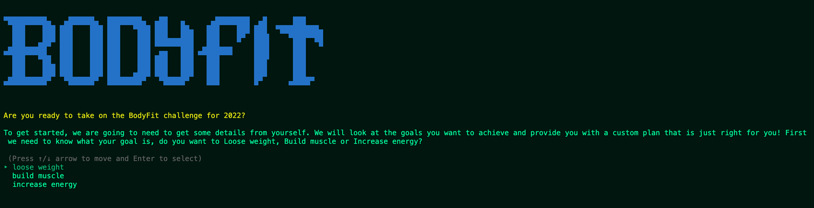

# MatildaMorton_Fitnessplan

# Purpose
BodyFit is a application that supports people to achieve thier health and fitness goals by providing customised plans that take into consideration thier goals, whether that be to loose weight, gain muscle or increase energy. It also considers thier current Body Mass Index, thier gender and thier current fitness levels. This application support a user inputting thier details and provides a fully customised plan based on thier input.

# Scope
So many fitness planners, don't take into consideration a persons individual needs. This application provides a truley customised solution. As an assessment, the scope of this application is quite small; however given the opportunity, I would like to see more functionality that also considers dietary requirement and disabilites. 

The target audience for this application is both female and male users, in the younger generation, particularly Gen Z. This particular genertion values personilised products more than any other generation and are also more health concious. The branding and overall marketing of the product is aimed at Gen Z. The relata ble wording and tone fo the messaging throughtout further supports this target audience reach.  

# Features
 - Calculate Body Mass Index
 - Custom goal selection
 - Custom plan downloads based on goal, BMI and gender and current fitness level

# User interaction
An end user will be able to load the program with the assumption that they have standard required technical tools and interact with it step by step. A user can then follow clearly the prpmpts to enter thier details and they will be given a final report designed just for them.

# what is the assessor looking for here?

Step 1 - User is provided a selection on what they are hoping to acheive as an outcome of the program. This is a menu navigation with instrucitons to use th up and down arrow key.

Step 2 - User is then provided with information about BMI and is asked to select thier Gender and input thier height and weight. Once entered user is provided with a meaage to let them know what thier BMI is and what this means. e.g overweight, within healthy or underweight. If does not put in correct details into the gets, errors are handled here and it requests the user to attempt the input again. 

Step 3 - Users are then prompted to input thier current fitness level using a menu selection and using up and down arrows and enter key to submit. 

Step 4 - Users are then provided with a final statement based on the details they have previously provided. "The final outcome of your selection is that you want to Build Muscle, your current BMI is 26.6 You said your fitness level is low. Are these selections correct?" The user has the option to confirm these details before thier final sheet is downloaded. If they select No, thse details are not correct, the program closes and needs to be re-run and this is explained to the user. 

STEP 5 - Once the user has confirmed thier final outcome, they are provided with a final message that will let them know thier plan is being downloaded and the sheet will download. 

STEP 6 - Program will say goodbye and end the program.

# Feature Diagram

# Error handling
The origional design did not utilise Tty prompt and had users entering information directly. This handled errors through using a while and elsif loop, since then I have replaced these menu options with tty select and this has solved most error handling. The other error handling I have is when the user imputs their height and weight. If a user imputs this as a string it will loop back and ask them to submit numbers only as it is not valid. If a user enters a calculation that becomes invalid such as hight 0 and weight 0 an arror occurs "divided by 0 (ZeroDivisionError)". To fix this I have added a rescue function for this section. 

# Project Management (Trello)
https://trello.com/b/Qp1PHQ80/terminal-application 

Develop an implementation plan which: - Please refer to Trello Board link for these. Dated Images below 🙂
- outlines how each feature will be implemented and a checklist of tasks for each feature 
- prioritise the implementation of different features, or checklist items within a feature
- provide a deadline, duration or other time indicator for each feature or checklist/checklist-item

# Help

Please note this guide only outlines instructions specific for Windows and MAC, if you are running an alternative operating system, most of this guide will apply however you will need to research specific steps. This application must be run on a laptop or or desktop device with a monitor. You must be running a standard operating system such as Windows, MacOS or Linux. This application cannot be run on a mobile or tablet device unless you have a terminal emulator installed. 

1. Install VS code if you want to manipulate the current features (Otherwise, skip this step) 
    - Instructions to download VS code can be found here https://code.visualstudio.com/download 

2. Install Ruby - https://www.ruby-lang.org/en/documentation/installation/ 

3. Open your command prompt or open Terminal through VS Code
    - Instructions on how to open command prompt   - https://towardsdatascience.com/a-quick-guide-to-using-command-line-terminal-96815b97b955 
    - Open Terminal VS Code for MAC- >open VS code>Terminal>New Terminal 
    - Open Terminal VS Code for Window - Open VS code>View>Integrated Terminal

4. Navigate to the folder MatildaMorton_T1A3 through your command line
    - To go into a folder type 'cd folderpath' then press enter - for example cd /user/folder/MatildaMorton_T1A3
     - To go back a folder type 'cd ..' into your command line

     5. Once in the correct folder path copy the below line into your command prompt or termal and press enter, this will run the application. 

     ./run.sh

     6. If at any point you close the application, simply redo step 5. 

     7. Use of this application is self explainitory in nature and it will step you thought each step. At the end, it will download a picture image of your final goal based on your selections within the application. This will download to the folder called 'SRC' within the MatildaMorton_T1A3 folder. If you cannot find this, use your search function and search either 'energy' or 'build-muscle-plan' or 'loose-weight'. This will be depending on which goal you initailly selected. 

